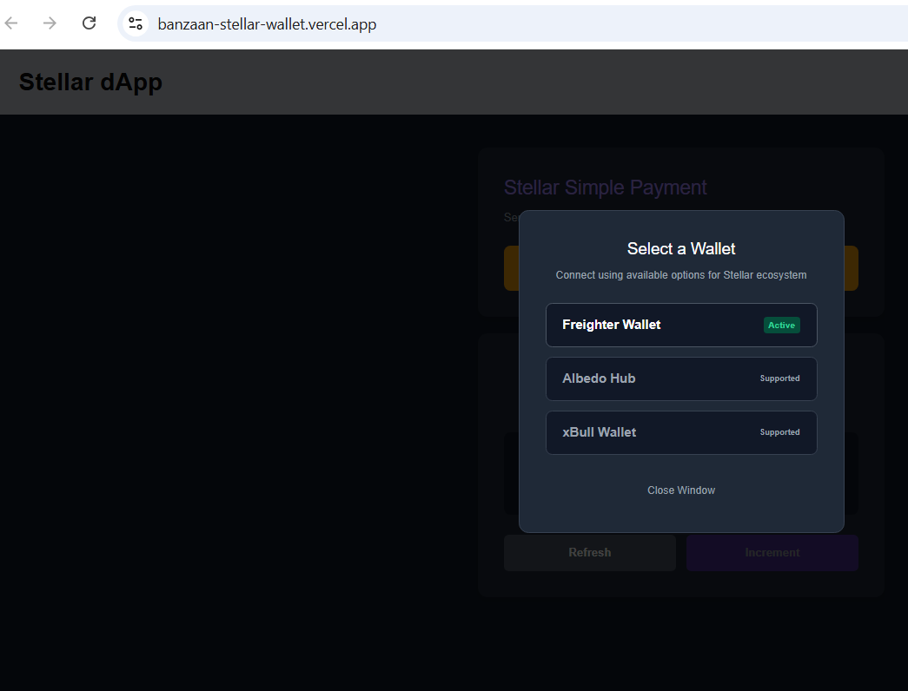
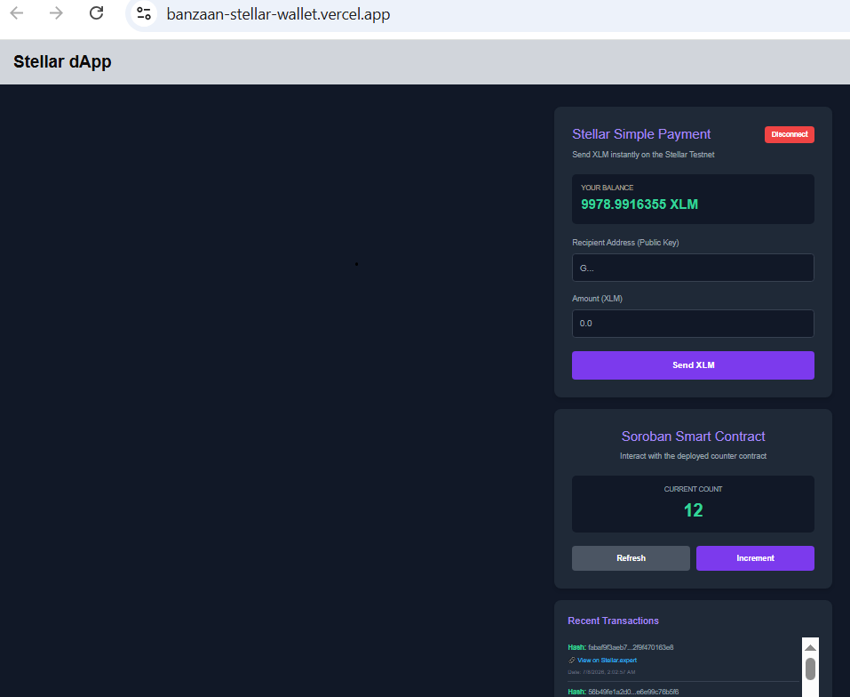
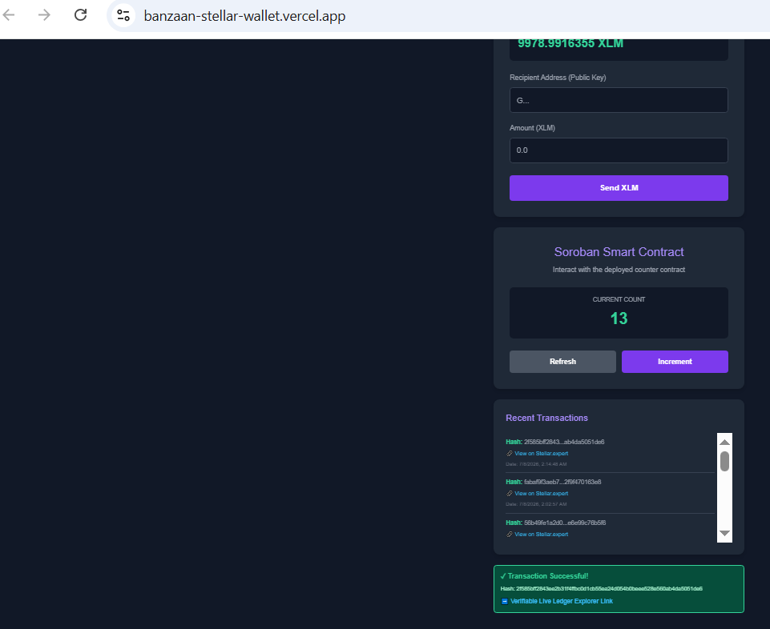

# ✦ Stellar & Soroban Full-Stack Web3 dApp

An advanced, production-grade full-stack Web3 decentralized application (dApp) built on the **Stellar Network** and powered by **Soroban Smart Contracts**. This project seamlessly combines classical Stellar ecosystem utilities (native payment tracking, asset flows) with cutting-edge WASM smart contract execution and robust client-side decentralized wallet state architectures.

🌐 **Live Demo:** [Click here to view the live deployed dApp](https://Banzaan-Stellar-Wallet.vercel.app)
🌐 **x posts:**[Build In Public Update](https://x.com/_banzaan/status/2074152897772728749?s=20)

---

## ✨ Core Architecture & Features

- 🔐 **Robust Freighter Wallet Integration:** Seamless one-click wallet linkage utilizing the official `@stellar/freighter-api`. Includes custom full-state front-end session terminations (**Disconnect Key feature**) which cleanly resets cache, balances, and operational telemetry.
- 🧪 **On-Chain Soroban Contract Interaction:** Interactive execution layers mapped to Rust-compiled WASM smart contracts on the Stellar Testnet. Users can dynamically execute transaction builders (`increment` invocations) and observe synchronous block mutations.
- 🛡️ **Defensive Triple-Error Handling Architecture:** Tailored execution boundaries that proactively trap Web3 injection crashes. Handles specific wallet paradigms gracefully without client-side failure or script breakage:
  - `Missing Key:` Catches missing dependencies or unlinked extensions before broadcast.
  - `UserReject:` Intercepts explicit user cancellations directly at the signing bridge (`signTransaction`), cleanly displaying standard descriptive alerts instead of common SDK unhandled runtime faults (`e.switch is not a function`).
  - `IncompatibleNetwork:` Enforces Testnet passphrase parameters strictly to prevent background RPC chain collision.
- 📊 **Real-Time Network Telemetry & Ledgers:** Implements programmatic state synchronization. Dynamically fetches native `XLM` account funding stakes from the Horizon Testnet and tracks the **10 most recent on-chain transactions** via decoupled reactive event hooks.
- 🔗 **Blockchain Explorer Integration:** Auto-generates cryptographic hash pointers routing directly to `Stellar.expert` for transparent confirmation auditing.

---
## 📸 Technical UI States
 
### 1. Multi-Wallet Connection Options (StellarWalletsKit)
*The dApp triggers a clean multi-wallet routing interface for selecting ecosystem components like Freighter, Albedo, or xBull.*


### 2. Wallet Connected & Balance Displayed


### 3. Successful Testnet Transaction Result


---

## 🛠️ Deep Dive Tech Stack

| Operational Layer | Core Infrastructure & Engine |
| --- | --- |
| **Frontend Core UI** | React.js + Modern Context Providers + Dynamic Reactive Architecture |
| **Stellar Interface SDK** | `@stellar/stellar-sdk` (Horizon & Soroban Clients Unified) |
| **Decentralized Wallet Hub** | `@stellar/freighter-api` (Encapsulated Sign-Bridge) |
| **Smart Contract Compiler** | Rust Lang + Soroban CLI WASM Compilation Target |
| **Target Network** | Stellar Testnet Passphrase Chain (`https://soroban-testnet.stellar.org`) |

---

## 🚀 Local Installation & Developer Guide

### Prerequisites
- [Node.js](https://nodejs.org/) (v18.0.0 or higher recommended)
- [Freighter Wallet Extension](https://www.freighter.app/) actively deployed on your browser, with the engine network config explicitly switched to **Testnet**.

### 🛠️ Step-by-Step Setup

1. **Clone the repository:**
   ```bash
   git clone [https://github.com/banzaan/Banzaan-Stellar-Wallet.git](https://github.com/banzaan/Banzaan-Stellar-Wallet.git)
   cd Banzaan-Stellar-Wallet
